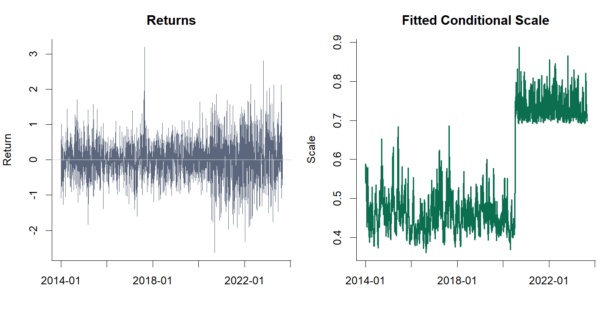
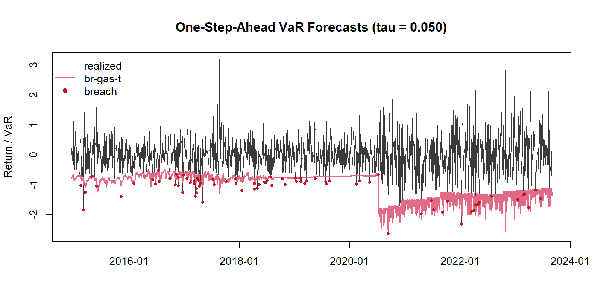

# brgasr

`brgasr` is a lightweight R package for fitting the break-regime generalized
autoregressive score model with Student-t innovations used in our carbon-market
tail-risk study.




The package is intentionally narrow in scope:

- It helps users fit the **core BR-GAS-t model**.
- It supports **one-step-ahead VaR and ES forecasting**.
- It includes a **bundled 10-year sample dataset** so users can try the model
  immediately.
- It includes **built-in visualization functions** for fitted scale dynamics and
  VaR forecast paths.
- It does **not** attempt to reproduce the full paper, the full data pipeline,
  or every benchmark table.

## Current package structure

- `R/` contains the model implementation and helper functions.
- `inst/extdata/hbea_sample.csv` contains a 10-year sample return series.
- `inst/examples/basic_usage.R` shows a complete end-to-end example.

## Installation

After pushing this folder to GitHub, installation can be done with:

```r
# install.packages("remotes")
remotes::install_github("Fin-stats/brgasr")
```

For local installation from this folder:

```r
install.packages("path/to/brgasr", repos = NULL, type = "source")
```

## Quick start

```r
library(brgasr)

sample_df <- sample_data()

fit <- fit_brgast(
  y = sample_df$ret,
  indicator = sample_df$post_break
)

summary(fit)

forecast_var_es(fit, tau = c(0.10, 0.05, 0.01))
plot(fit, dates = sample_df$date)
```

Typical one-step-ahead output on the bundled sample data:

```r
   tau        var        es
1 0.10 -0.8668487 -1.249494
2 0.05 -1.1421138 -1.508267
3 0.01 -1.7282036 -2.088567
```

## Rolling forecast example

```r
library(brgasr)

sample_df <- sample_data()

roll_out <- roll_brgast(
  data = sample_df,
  win = 250,
  refit_every = 60,
  tau = c(0.05, 0.01)
)

head(roll_out$forecasts)
roll_out$evaluation
plot_var_es_forecasts(roll_out$forecasts, tau = 0.05)
```

Rolling forecasts use warm starts by default so that re-estimation remains
practical on longer samples.

